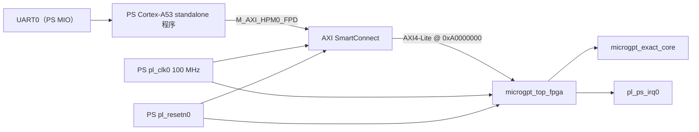

# ZCU106 Baremetal PS+PL microGPT 架构参考文档

> 状态：已在 ZCU106 上通过 OCM-only UART bring-up 验证。
> 目标板卡：Xilinx ZCU106，器件 `XCZU7EV-2FFVC1156E`。
> 参考用途：供其他 FPGA 加速器项目复用这套 PS+PL baremetal bring-up 方法。

## 1. 总览

TALOS-V2 将 microGPT 推理加速器放在 PL 侧运行，并由 Zynq UltraScale+ MPSoC 的 PS 侧通过 AXI4-Lite 进行控制。为了让上板调试路径足够稳健，本工程采用分层 bring-up：

1. 使用 Vivado 为 `design_1_wrapper` 生成 bitstream 和 XSA。
2. 通过 JTAG 下载 PL bitstream。
3. 加载 Vivado 生成的 `psu_init.tcl` 初始化 PS。
4. 在 XSDB memory map 中加入 PL AXI 地址窗口。
5. 下载并运行 A53 OCM-only standalone ELF。
6. 逐层验证 UART、AXI4-Lite 首读、寄存器读回、错误路径和 microGPT 推理。

OCM-only ELF 的核心价值是：首轮 bring-up 不依赖 DDR，也不依赖板上 QSPI/SD 启动链路。OCM 路径稳定之后，再切换到普通 Vitis standalone DDR 链接应用，做更完整的软件测试。

## 2. 硬件架构



### 关键设计选择

| 领域 | 选择 | 原因 |
|---|---|---|
| 主机接口 | AXI4-Lite slave | PS 侧可以用内存映射方式直接访问控制/状态寄存器。 |
| 时钟 | PS `pl_clk0` 提供单一 100 MHz PL 时钟 | 避免 DE1-SoC 版本中的 CDC 和外部板级时钟依赖。 |
| 复位 | PS `pl_resetn0` 直接连接 PL 逻辑 | bring-up 阶段足够使用；正式工程建议增加 Processor System Reset IP 改善复位同步。 |
| 首阶段软件 | A53 OCM-only ELF | 排除 DDR、FSBL、启动介质等变量，先验证 PS→PL 基础链路。 |
| 模型权重 | `$readmemh` 初始化的片上 ROM | 小模型无需 DDR DMA，便于最小闭环验证。 |

## 3. 工程目录映射

| 路径 | 作用 |
|---|---|
| `scripts/vivado_zcu106.tcl` | 创建 ZCU106 Vivado 工程、Block Design、bitstream 和 XSA。 |
| `syn/vivado_zcu106/microgpt_top_fpga.v` | `microgpt_exact_core` 的 AXI4-Lite wrapper。 |
| `rtl/src/microgpt_exact_core.sv` | 平台无关的 microGPT 推理核心。 |
| `rtl/src/include/microgpt_exact_core_rom_init.svh` | 权重 ROM 初始化入口。 |
| `syn/vivado_zcu106/ocm_app/microgpt_ocm_bringup.c` | OCM-only A53 bring-up 与回归测试程序。 |
| `syn/vivado_zcu106/ocm_app/lscript_ocm.ld` | A53 OCM 链接脚本，入口位于 `0xFFFC0000`。 |
| `scripts/build_microgpt_ocm.sh` | WSL2 下手工构建 OCM-only ELF 的脚本。 |
| `syn/vivado_zcu106/download_microgpt_ocm.tcl` | XSDB 下载脚本：烧录 PL、PS 初始化、memmap、下载 OCM ELF。 |
| `syn/vivado_zcu106/microgpt_baremetal_main.c` | 更完整的 Vitis standalone 应用，适合 DDR/BSP 场景。 |
| `syn/vivado_zcu106/hw_verify.tcl` | XSDB 直接读写寄存器的硬件验证脚本。 |

## 4. 构建与上板流程

### 4.1 生成 bitstream 和 XSA

在 Windows Vivado Tcl Shell 中执行：

```tcl
cd C:/workspace/TALOS-V2
source scripts/vivado_zcu106.tcl
```

预期输出：

```text
C:/workspace/TALOS-V2/build/microgpt_zcu106.bit
C:/workspace/TALOS-V2/build/vivado_zcu106/microgpt_zcu106.xsa
```

### 4.2 构建 OCM-only ELF

在 WSL2 中执行：

```bash
cd /mnt/c/workspace/TALOS-V2
bash scripts/build_microgpt_ocm.sh
```

如果脚本找不到 standalone A53 BSP，需要手工指定 Vitis 生成的 BSP 路径：

```bash
export TALOS_BSP_ROOT=/mnt/c/workspace/TALOS-V2/build/vitis_workspace/microgpt_zcu106_platform/psu_cortexa53_0/standalone_a53_0/bsp
bash scripts/build_microgpt_ocm.sh
```

预期 ELF：

```text
/mnt/c/workspace/TALOS-V2/build/microgpt_ocm_bringup.elf
```

构建脚本会打印 ELF 入口和关键符号。稳健的 OCM ELF 应满足：

```text
start address 0x00000000fffc0000
00000000fffc0000 g .text _vector_table
00000000fffc0938 g .text _boot
```

### 4.3 下载并运行

在 WSL2 中执行：

```bash
/opt/Xilinx/Vitis/Vitis/bin/xsdb /mnt/c/workspace/TALOS-V2/syn/vivado_zcu106/download_microgpt_ocm.tcl
```

如果本机 Xilinx 安装目录带版本号，可以改用类似路径：

```bash
/opt/Xilinx/2025.2/Vitis/bin/xsdb /mnt/c/workspace/TALOS-V2/syn/vivado_zcu106/download_microgpt_ocm.tcl
```

UART0 参数：`115200 8N1`。

## 5. 寄存器映射

基地址：`0xA0000000`。Vivado 为该 AXI4-Lite slave 分配 4 KB 地址范围。

| 偏移 | Word | 访问 | 名称 | 说明 |
|---:|---:|---|---|---|
| `0x000` | `0x000` | R | MAGIC | 固定值 `0x4D475254`（`MGRT`），用于 AXI 首读连通性检查。 |
| `0x004` | `0x001` | R | VERSION | 固定值 `0x00020001`。 |
| `0x008` | `0x002` | W | CONTROL | bit0 启动推理，bit1 清除/复位 wrapper 状态。 |
| `0x00C` | `0x003` | R | STATUS | `{pos, out_len, 8'b0, flags}`。 |
| `0x010` | `0x004` | R/W | CONFIG | `{temperature_q8_8[15:0], max_gen[7:0], 8'b0}`。 |
| `0x014` | `0x005` | R/W | SEED | RNG seed。 |
| `0x018` | `0x006` | R | DEBUG | `{top_logit, argmax_token, last_token}`。 |
| `0x01C` | `0x007` | R | BOS | BOS token，当前为 26。 |
| `0x060` | `0x018` | R | OUTPUT[0] | 生成 token 0。 |
| `0x060..0x09C` | `0x018..0x027` | R | OUTPUT | 最多 16 个生成 token。 |
| `0x0D8` | `0x036` | R | PERF_CYCLES | 最近一次推理的 core 周期数。 |
| `0x0DC` | `0x037` | R | TOKENS_PER_SEC | 预留/读回项；当前吞吐率由软件计算。 |
| `0x100..0x168` | `0x040..0x05A` | R | LOGITS | 27 个 signed Q12 logits。 |

STATUS 低位含义：

| Bit | 名称 | 含义 |
|---:|---|---|
| 0 | ready | wrapper 已准备好接收 start 请求。 |
| 1 | busy | core 正在处理。 |
| 2 | done | 推理完成，或非法请求已被锁存。 |
| 3 | error | 非法请求或硬件错误。 |
| 4 | unused toggle | 兼容 DE1-SoC 旧接口的保留位。 |
| 5 | direct | direct step 模式已启用。 |

## 6. OCM-only 测试覆盖

OCM 测试程序刻意按 bring-up 层级排序，避免把 UART、OCM、JTAG、AXI 和 PL 推理混在一起调：

1. UART 心跳：确认 PS 程序已运行，UART0 路径可用。
2. 寄存器连通性：检查 `MAGIC`、`VERSION`、`BOS`。
3. clear 路径：写 `CONTROL` clear，并检查 `ready`。
4. 空闲默认读回：检查运行态寄存器暴露的 `CONFIG`、`SEED` 默认值。
5. 非法请求处理：使用 `max_gen=0` 启动，期望 `done + error`。
6. 推理 smoke：seed=1、temperature=0.5、max_gen=4。
7. 确定性测试：同一 seed 重复运行，检查 token 序列一致。
8. 不同 seed smoke：seed=42，覆盖另一条 RNG 路径。

通过时 UART 末尾类似：

```text
SUMMARY: 29 passed / 0 failed
RESULT: PASS
=== Done ===
```

## 7. 常见 bring-up 问题

### 7.1 XSDB 拦截 PL 地址访问

现象：

```text
Blocked address 0xA0000000. PL AXI slave ports access is not allowed.
```

在 `mrd`/`mwr` PL 地址前增加：

```tcl
memmap -addr 0xA0000000 -size 0x00001000 -flags 3
```

本工程的 OCM 下载脚本和硬件验证脚本已经包含该处理。

### 7.2 OCM ELF 入口必须是 `_vector_table`

不能只看 ELF section 是否落在 OCM 地址范围，还必须确认入口和符号：

```text
start address 0x00000000fffc0000
00000000fffc0000 g .text _vector_table
```

如果 `_start` 未定义，或入口落到 C runtime helper，A53 可能不会正确初始化栈、BSS 和 UART，表现为无串口输出。

### 7.3 bitstream 成功和 XSA 导出成功是两件事

`write_bitstream` 成功说明 `.bit` 文件可用于配置 PL。`write_hw_platform` 失败只影响 Vitis 平台导出，不等价于 bitstream 不可用。本工程当前预期二者都成功。

### 7.4 Vivado 旧 run/cache 可能打包旧 RTL

修改 RTL 后，应重新生成 bitstream，必要时清理旧工程或强制 Vivado run 重新执行。不要假设已有 `.bit` 一定包含最新 RTL。

### 7.5 CONFIG/SEED 读回语义

`REG_CONFIG` 和 `REG_SEED` 的读口反映的是 wrapper 当前运行态寄存器，而不是刚写入的 host shadow 寄存器。测试时不要把“写后立即读回”当作 host shadow 验证；应通过下一次推理行为或空闲默认读回来验证。

## 8. 迁移到其他项目的 Checklist

如果要把这套方法迁移到其他 PL 加速器项目，建议按以下清单执行：

1. 定义最小 AXI4-Lite 寄存器表，并包含固定 `MAGIC`/`VERSION` 首读寄存器。
2. 在 bring-up 阶段分配一个 PS 可见基地址，例如 `0xA0000000`。
3. 初始 PL 测试保持自包含，不要一开始引入 DDR DMA。
4. 提供 Vivado Tcl 脚本，稳定生成 `.bit`、`.xsa` 和 `psu_init.tcl`。
5. 提供 OCM linker script，使用 `ENTRY(_vector_table)`，并保留 `.vectors`/`.boot` 在最前。
6. 编写最小 OCM A53 程序，先打印 UART 心跳，再访问 PL。
7. 在 XSDB 直接 `mrd`/`mwr` PL 地址前添加 `memmap`。
8. 分层验证：UART、MAGIC、寄存器读回、非法命令、一次计算、确定性重复。
9. 保存 UART 日志作为发布或回归证据。
10. OCM 路径稳定后，再推进 DDR-linked standalone 应用或 Linux/PetaLinux 驱动。

## 9. 当前验证证据

当前 `build/log/uart.log` 中 OCM-only 测试已经通过：

```text
[PASS] MAGIC = 0x4D475254
[PASS] VERSION = 0x00020001
[PASS] CONFIG default = 0x00800F00
[PASS] error after invalid request (0x0000000C)
Output text: "iht"
Token IDs: [8, 7, 19]
SUMMARY: 29 passed / 0 failed
RESULT: PASS
```

这说明以下链路已经闭环：PS UART、PL bitstream、AXI4-Lite 首读、wrapper 控制、microGPT core 执行、输出 token 读回、OCM baremetal 程序执行。
